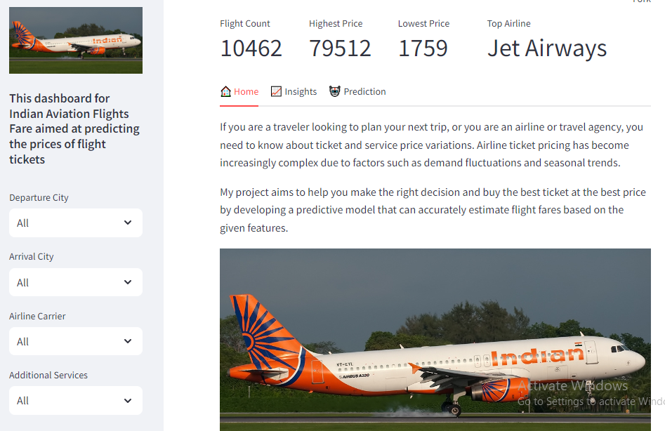
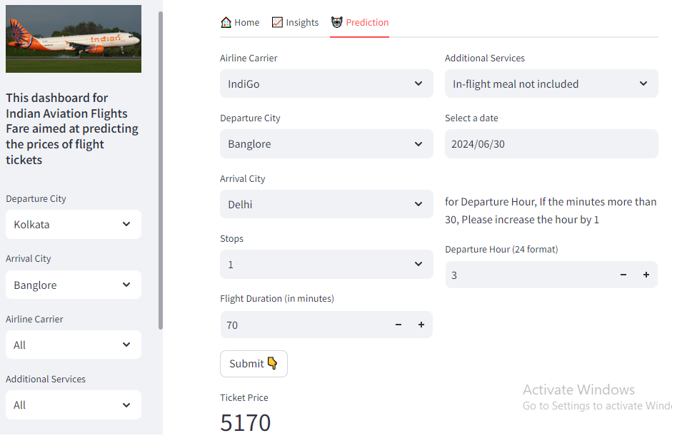

# ✈️ Aviation Flight Fare Prediction

This project predicts airline ticket prices using **Machine Learning** and provides an **interactive dashboard** built with Streamlit.  
It demonstrates a full ML workflow: **data preprocessing → feature engineering → model training → evaluation → deployment**.

---

## 📌 Overview
Flight prices vary based on multiple factors such as airline, source, destination, date, stops, and duration.  
The goal of this project is to build a predictive model that estimates ticket prices and visualize results interactively.

---

## 📂 Repository Structure
```
Aviation-Flight-Fare-Prediction/
│
├── data/                  # Sample datasets (train/test/cleaned)
├── notebooks/             # Jupyter notebooks for EDA & experiments
├── src/                   # Reusable Python scripts (data prep, training)
├── models/                # Trained model files
├── apps/                  # Streamlit dashboard
├── images/                # Plots & screenshots for README
├── output/                # Reports, results
├── requirements.txt       # Dependencies
└── README.md
```

---

## 📊 Dataset
- **Source**: Public Kaggle dataset for flight fares in India.  
- **Files**:
  - `data/train_raw.csv` — training dataset  
  - `data/test_raw.xlsx` — test dataset  
  - `data/cleaned_df.csv` — processed dataset  

Main features:
- Airline  
- Date of Journey  
- Source & Destination  
- Route, Duration, Total Stops  
- Price (target variable)

---

## 🔎 Exploratory Data Analysis (EDA)
Performed in `notebooks/aviation_flight_fare_prediction.ipynb`:
- Checked null values, duplicates  
- Converted date/time columns  
- Extracted useful features (day, month, duration in minutes)  
- Encoded categorical variables (Airline, Source, Destination)  
- Outlier detection  

---

## 🤖 Machine Learning Model
- Algorithms tested: **Random Forest Regressor, Decision Tree, XGBoost**  
- Best-performing model: **Random Forest**  
- Evaluation metrics (approximate values — update if you have exact):
  - **MAE**: ~1180  
  - **RMSE**: ~2100  
  - **R² Score**: ~0.82  

Final model saved in: `models/flight_fare_model.joblib`

---

## 🖥️ Dashboard (Streamlit)
Interactive dashboard for predictions:
- User can select Airline, Source, Destination, Date of Journey, Stops  
- Model outputs estimated fare  
 

### Run locally
```bash
# Create and activate virtual environment (recommended)
python -m venv .venv

# mac / linux
source .venv/bin/activate

# windows (PowerShell)
.venv\Scripts\Activate.ps1
# أو (cmd)
.venv\Scripts\activate

# Install dependencies
pip install -r requirements.txt

# Run Streamlit app
streamlit run apps/aviation_fare_dashboard.py
```

---

## ⚙️ Reproduce model training
```bash
python src/train_model.py --data data/train_raw.csv --output models/flight_fare_model.joblib
```

---

## 📷 Results & Screenshots





---

## 🚀 Future Work
- Add airline-specific and date-seasonality analysis  
- Extend dataset with more airlines/routes 
- Make a small API (Flask/FastAPI) to serve predictions


---

## 👩‍💻 Author
**Omayma Ali** — Data Scientist & Machine Learning Engineer  

- [GitHub](https://github.com/Omayma-ali)  
- [LinkedIn](www.linkedin.com/in/omayma-ali)  
- [Fiverr](https://www.fiverr.com/users/omaymaaa)
- [Khamsat](https://khamsat.com/user/omayma_ali)
